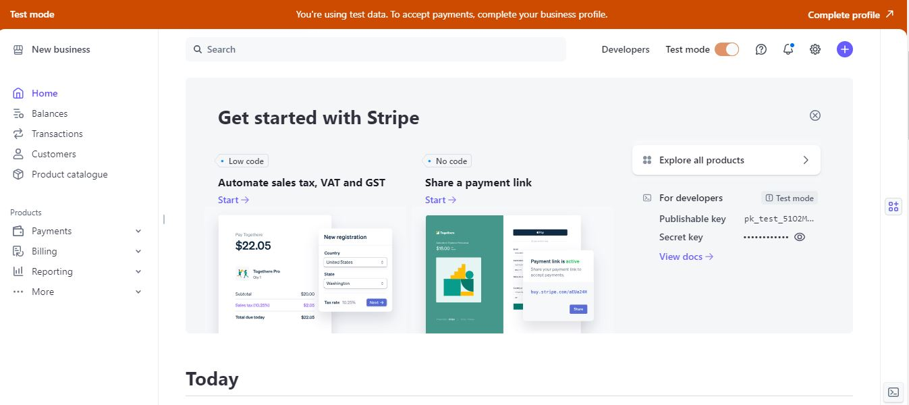

# Bespoke Equestrian

**Deployed  Website: [Link to website]()

## About

Bespoke Equestrian is an Irish based online equine retailer who speclaises in bespoke / custom equestrian products. It offers a service where customer can purchse items and get them made in their own distinct colors , or purchase off the rack products and have them customised with there own logo or branding. This service enables all yards and stables to full customise there look and remain on brand at all times , while competing or working at home.

## User Experience
### Target Audience

The website is intended to be used by primary the equine industy ,however it can be used by anyone who wishes to purchse our products and have them cusromosed to suit there needs. 

### User Stories
#### First Time User Goals

 As a user / customer:
*   I can view different products on offer.
*   I can select a product category to view.
*   I can sort products by price, rating, name .
*   I can search for specific items using the search box.
*   I can click on a product to see a more information about the product.
*   I can add a product to my shopping bag.
*   I can add the desired quantity of an item to my shopping bag.
*   I can view and update my shopping bag. 
*   I can securely purchase the items by giving my delivery details and card information.
#### Returning User Goals
As a returning customer:
*   I want to be able to be able to have access to my account without having to continously login.
*   I want to be able to view my previous orders.
*   I want to be able to edit and update my address details.
#### Site Owner/Admin Goals

As a Admin:

*   I want to be able to add new products.
*   i want to be able to edit and update products.
*   I want to be able to delete products.
*   I want to be able to send emails to customers about discounts and new producst.

## Features

### About Us 

The customer can read a detailed about us page to find out more about our business and the services and/or products that we offer.

### Contact

### Shopping Bag

### Custom Error Pages
The project a custom HTML error page for status codes 403 (Forbidden), 404 (Not Found) and 500 (Internal Server Error) for improved user experience. This maintains a consistent design across the site.
## Design
### Color Scheme
### Typography
### Imagery

## Ecommerce Business Model

The business model for this ecommerce website is a Business to Customer (B2C) model.

### Aim
The main aim for Bespoke Equestrian is to generate brand awareness and establish a reputation for providing quality equestrian wear which in turn will hopefully increase sales if they can fulfil the customer’s requirement.

## Marketing Strategies
### Digital Media Needs
In order to meet the digital media needs of Bespoke Stables they intend to utilise a number of e-marketing tools, such as social media, search engine optimisation, email marketing and online advertising. 

#### Social Media
*   Social media is a huge platform for businesses as it generates a wide reach.
*   Almost everyone is on some form of social media be it Facebook, Twitter or Instagram.
*   It is also free to use but you have the option to boost posts by paying a fee.
*   It is important to post frequently on social media which some may find difficult to do.
*   This is why e-tools such as Buffer and Hootsuite can come in handy. These are post scheduling sites where you can organize posts for different media sites and choose when you want them to go live.
*   It is also important to create content that includes an image to grab people’s attention.
*   Text alone is not enough to make people pay attention to your post.

##### Advantages
*   Large Audiences - Facebook has 1.13 billion users, Twitter has 313 million monthly active users, Instagram has 500 million, and Pinterest has about 110 million.
*   Free to create - One of the biggest advantages of social media marketing is that it is entirely free to businesses.
*   Encourage sharing - People love to share things with their networks, from photos and recipes to interesting articles and hot deals.

#### Email Marketing
Email Marketing allows you to send newsletters and announcements to subscribers by the mass.
Once someone subscribers to the newsletter, Bespoke Equestrian can use an e-tool such as Mail Chimp,  keep all their subscribers email addresses and send the email to everyone.

##### Advantages
*   Flexible design - can send plain text, graphics or attach files - whichever suits.
*   Scalable - used to reach large audience or smaller targeted lists
*   Sharable - it’s easy for people to forward, building your reputation by word of mouth or viral marketing.
*   Measurable - easy to attribute value to a campaign by using web analytics software.
*   Cost effective - can be much lower than many other forms of marketing
*   Time saving - through automation you can trigger emails to be sent to users based on an action they have performed on your website

#### Search Engine Optimisation
Search Engine Optimisation is an important part of Digital Marketing as it allows your website or Social Media page to be seen.
*   To keep an eye on how your pages are doing in terms of SEO, e-tools such as Google Analytics, Google Page Speed Insights and Google Web Master Tools can be used to see what is working well and what needs to be improved.
*   On these you can view what region or country the majority of your page views are from as well as how long each visitor stays on your page.
*   If they are leaving quickly, the reason could be that your page loads slowly. People do not like having to wait more than 3 seconds for a page to load.

##### Advantages
* by Consumers – When they search for a particular product or service, they trust that the top result is the best one. This is not necessarily the case, but the top result does have some very good search engine marketing thanks to this assumption.
*   Trackable – search engine marketing allows you to see just what is and isn’t working.
*   Targeted Traffic – The traffic you receive to your website from a search engine is made up of users who searched for applicable search terms related to your business. This is much more productive than meaningless hits that will not turn into sale

## Wireframes

## Agile Methodology 

## Technologies Used
The following technologies were used to complete this project.

### Languages:
*   [Python](https://www.python.org/downloads/release/python-385/): the primary language used to develop the blog
*   [HTML](https://developer.mozilla.org/en-US/docs/Web/HTML):the markup language used to create the blog.
*   [CSS](https://developer.mozilla.org/en-US/docs/Web/css):the styling language used to style the blog.

### Frameworks
*   [Django](https://www.djangoproject.com/): python framework used to create all the logic.
*   [GitHub](https://github.com/) was used to host the project code after being pushed.
*   [Heroku](https://dashboard.heroku.com/apps) - was used to deploy the project.

### Databases:
*   [SQLite](https://www.sqlite.org/): this database was used during development .
*   [PostgreSQL](https://www.postgresql.org/): is the database used to store all blog data.

### Other
*   [Gunicorn](https://gunicorn.org/): is the web server used to run the blog.
*   [Psycopg2](https://www.psycopg.org/): is the database driver.
*   [Django-allauth](https://django-allauth.readthedocs.io/en/latest/): the authentication library used to create user accounts.
*   [Django-crispy-forms](https://django-cryptography.readthedocs.io/en/latest/): was used to control the rendering behavior of Django forms.
*   [Django-countries](https://pypi.org/project/django-countries/): was used to  provide country choices for use with forms.
*   W3C CSS Validation [W3C CSS Validation](https://jigsaw.w3.org/css-validator/)
*   W3C Markup Validation [W3C Markup Validation](https://validator.w3.org/)
*   JSHint to validate my javascript code [JSHint](https://jshint.com/)

## Testing 

Please refer to the [Testing](Testing.md) file  for all testing related documentation.

## Deployment

### Deployment to GitHub Pages
The site was deployed to GitHub pages. The steps to deploy are as follows:
*   In the GitHub repository, navigate to the Settings tab
*   From the source section drop-down menu, select the Main Branch, then click "Save".
*   The page will be automatically refreshed with a detailed ribbon display to indicate the successful deployment.

The live link can be found here: [Github](https://github.com/AmandaB2023/Bespoke_Equestrian.git)

### Local Deployment
In order to make a local copy of this project, you can clone it. In your IDE Terminal, type the following command to clone my repository.

1.   Sign in to GitHub, locate the repository and click to open the repository.
2.   On the repository main page, click the green code button where the files are located. 
3.   This will open a drop down menu.
4.   In the dropdown menu stay on the HTTPS option and click the copy icon button next to the URL to copy it.
5.   Next open Git Bash and type git clone and your directory link.#
6.  Then type cd and the directory name.
7. Then code . to open VS Studio using Windows.

### Deployment using Heroku

To deploy the repository:
1.   Log into or sign up for a Heroku account.
2.   Navigate to the dashboard.
3.   Navigate to "New" in the top right, select "Create New App" from dropdown menu.
4.   Enter a unique name for the app. 
5.   Select your region.
6.   Click  "Create App".
7.   Navigate to "Deploy"  scroll down to "Deploy Method" and connect the repository with GitHub.
8.   Navigate to "Settings".
9.   In the section "Config Var", click on the button "Reveal Config Vars".
10. Click on "Add a new Config Var" and add the necessary keys and values.
    - SECRET_KEY with the value of the secret key.
    - DATABASE_URL with the value of the database URL.
    - CLOUDINARY_URL with the value of the cloudinary URL.
    - STRIPE_SECRET_KEY with the value of the secret key.
    - STRIPE_PUBLIC_KEY with the value of the public key.
    - STRIPE_WH_SECRET with the value of the webhook handler secret key.
    - EMAIL_HOST_PASS with the value of the API key.
    - EMAIL_HOST_USER with the value of the email address.
11. Navigate to section "Deploy" on the top navigation menu.
12. Select "GitHub" as the deployment method.
13. Search for the repository to be deployed by using the search bar and click "Connect".
14. Select the repository branch to be deployed.
15. Choose "Manual" deployment.
    - Manual deployment must be manually re-deployed after pushing new changes to the repository.
    - Crucial when working with DEBUG=True during development.
16.  Click the button "View" to open the link to the deployed project.

### Payment Setup - Stripe
1. Register a stripe account at [Stripe-site]( www.stripe.com)
2. Go to  Get Started with Stripe.

3. Select API keys.
4. Copy the `public key` and `secret key` to the `env.py` file.
5. Add the following setting to `settings.py`:
  STRIPE_PUBLIC_KEY = os.environ.get("STRIPE_PUBLIC_KEY")
  STRIPE_SECRET_KEY = os.environ.get("STRIPE_SECRET_KEY")

6.  Install stripe package: pip3 install stripe
7. In case users prematurely close the purchase-order page or internet connection fails during payment processing, it is important include Stripe Webhooks.
    *   Navigate to "Developers" on the top page menu.
    *   In the section "Webhooks", select "Add Endpoint".
    *   Add the webhook URL.
    *   Select "Receive All Events".
    *   Click the button "Add Endpoint" to complete the process.
    *   You will find one key under signing secret.
    *   STRIPE_WH_SECRET = Signing Secret (Wehbook) Key (starts with wh)
    *   Add to env.py
 8. Add the link to [stripe's JavaScript](https://docs.stripe.com/js) in your base html template.

## Credits

## Acknowledgements