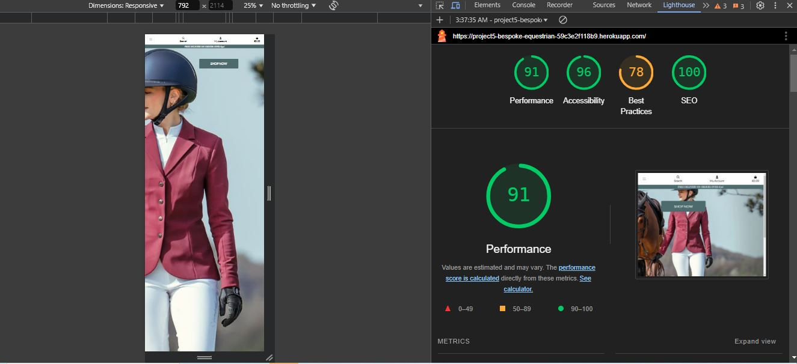
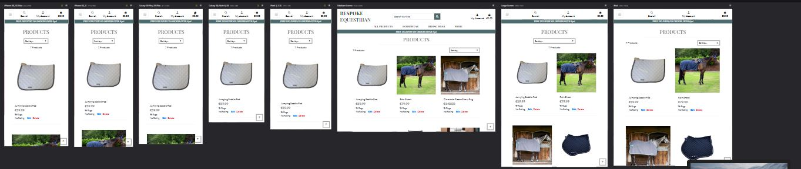
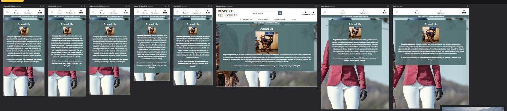

# Bespoke Equestrian - Testing

## Lighthouse

I undertook lighthouse testing an fell down slightly on best practices, this was mainly due to using jquery, bootstraps and stripe.

## Responsiveness
The website was checked manually using Devtools on both Microsoft Edge and Google Chrome.

The website was also checked using the responsive viewer extention on google chrome which shows the website on various different screen sizes.

## Manual Testing

| Feature | Action | Expected result | Tested | Passed | Comments |
| --- | --- | --- | --- | --- | --- |
| Navigation | Click on the "Logo" link | The user is redirected to the home page | Yes | Yes | - |
| | Click on the "Home" link | The user is redirected to the main page | Yes | Yes | - |
| | Click on the " All Products" link | The user is given options in a dropdown list | Yes | Yes | - |
| | Click on the " Horsewear" link | The user is given options in a dropdown list | Yes | Yes | - |
| | Click on the " Ridingwear" link | The user is given options in a dropdown list | Yes | Yes | - |
| | Click on the " About" link | The user is given options in a dropdown list | Yes | Yes | - |
| | Enter item into search box | Item is found and displayed to user  | Yes | Yes | - |
| | Click " My Account"  button | The user is given options in a dropdown list  | Yes | Yes | - |
| | Click on "Bag" button | The user is brought to the shopping bag | Yes | Yes | - |
| Navigation - My Account - First tme user| On click provides 2 options Register or Login | The user is redirected there selected page| Yes | Yes | - |
| | Login| The user is brought to the login page | Yes | Yes | - |
| | Register| The user is brought to the Register page | Yes | Yes | - |
| Navigation - My Account - Returning user | |The user is already logged in | Yes | Yes | - |
| | | The user has two options My Profile or Logout | Yes | Yes | - |
| | Logout| The user is brought to the logged out of their profile | Yes | Yes | - |
| | My Profile| The user is brought to their Profile  page | Yes | Yes | - |
| Navigation - My Account - Admin | The admin has an extra option Product Managment | Yes | Yes | - |
| | Product Management| The admin is brought to the product management page where they can  add products  | Yes | Yes | - |
| Horsewear | On Dropdown| The user is given option to  select different catagories of products| Yes | Yes | - |
| Ridingwear | On Dropdown| The user is given option to select different catagories of products | Yes | Yes | - |
| More | On Dropdown| The user is given option to select about, contact or FAQ | Yes | Yes | - |
|Products |All Products  |The user can view alll products available | Yes | Yes | - |
|  |Product View |The user can can view full details about the product | Yes | Yes | - |
|  | |The user can increase and decrease the quantity of the product | Yes | Yes | - |
|  | |The user can add the product to their shopping bag | Yes | Yes | - |
|  | |A notification on the bag tells the user the product has been added to bag | Yes | Yes | - |
|  |Product View - Admin |The admin can edit and delete products | Yes | Yes | - |
| Shopping Bag  |User clicks on the shopping bag icon  |User is brought to the shopping bag page | Yes | Yes | - |
|  |User clicks on increae or decrese quantity  | Quantity will increat on decrese on clicking  update | Yes | Yes | - |
|  |User clicks on delete  | Item is deleted from shopping bag | Yes | Yes | - |
|  | | If bag is empty will be invited to keep shopping | Yes | Yes | - |
| Checkout  |User clicks on the secure checkout  |User is brought to the checkout page | 
|  |User is asked to enter their delivery details  | If incorrect will recieve notification | Yes | Yes | - |
|  | User is asked to enter their card details  |  | Yes | Yes | - |
|  | If Correct | User is brought to order conformation page  | Yes | Yes | - |

## Validation Testing

### HTML

All HTML was validated using  [HTML W3C Validator](https://validator.w3.org)

### CSS

All Css was validated using [W3C Jigsaw](https://jigsaw.w3.org/css-validator/)
### Javascript
| File Name             | Pass | View Result                                                              | Notes                                                                                                                                                                                            |
| --------------------- | ---- | ------------------------------------------------------------------------ | ------------------------------------------------------------------------------------------------------------------------------------------------------------------------------------------------ |
| Home       |   |   |  
| base.css          | ✅    | [Result](documentation/css_valadation_be.jpg)      |  
  

### Python 
The javascrip for this project was validated using [Jshint](https://jshint.com/)

| File Name             | Pass | View Result                                                              | Notes                                                                                                                                                                                            |
| --------------------- | ---- | ------------------------------------------------------------------------ | ------------------------------------------------------------------------------------------------------------------------------------------------------------------------------------------------ |
| Home       |   |   |  
| checkout.js          | ✅    | [Result](documentation/checkout_js.jpg)      |  
| profiles.js            | ✅    | [Result](documentation/profiles_js.jpg)      |  
### Python 

The Python files for this project were validated using  [PEP8 CI Online](https://pep8ci.herokuapp.com/)

| File Name             | Pass | View Result                                                              | Notes                                                                                                                                                                                            |
| --------------------- | ---- | ------------------------------------------------------------------------ | ------------------------------------------------------------------------------------------------------------------------------------------------------------------------------------------------ |
| Home       |   |   |  
| views.py            | ✅    | [Result](documentation/home_views.jpg)      |         
| urls.py          | ✅    | [Result](documentation/home_urls.jpg)      |  
| models.py          | ✅    | [Result](documentation/home_models.jpg)  
| Bespoke Equestrian     |   |   |  
| views.py            | ✅    | [Result](documentation/be_views.jpg)      |         
| urls.py          | ✅    | [Result](documentation/bag_urls.jpg)      |  
| settings.py          | ✅    | [Result](documentation/be_setting.jpg)  
| Products      |   |   |  
| views.py            | ✅    | [Result](documentation/)      |         
| urls.py          | ✅    | [Result](documentation/home_urls.jpg)      |  
| models.py          | ✅    | [Result](documentation/home_models.jpg)  
| forms.py          | ✅    | [Result](documentation/h) 
| admin.py          | ✅    | [Result](documentation/h) 
| Bag     |   |   |  
| views.py            | ✅    | [Result](documentation/bag_views.jpg)      |         
| urls.py          | ✅    | [Result](documentation/bag_urls.jpg)      |  
| models.py          | ✅    | [Result](documentation/)  
| contexts.py        | ✅    | [Result](documentation/bag_contects.jpg) 
| Checkout     |   |   |  
| views.py            | ✅    | [Result](documentation/checkout_views.jpg)      |         
| urls.py          | ✅    | [Result](documentation/checkout_urls.jpg)      |  
| models.py          | ✅    | [Result](documentation/checkout.models.jpgmodels.jpg)  
| forms.py          | ✅    | [Result](documentation/checkout_forms.jpg) 
| admin.py          | ✅    | [Result](documentation/checkout_admin.jpg) 
| webhooks.py          | ✅    | [Result](documentation/checkout_webhooks.jpg) 
| webhooks_handler.py          | ✅    | [Result](documentation/checkout_webhooks_handler.jpg) 
| signals.py          | ✅    | [Result](documentation/checkout_signals.jpg)
| Profiles    |   |   |  
| views.py            | ✅    | [Result](documentation/profiles+views.jpg)      |         
| urls.py          | ✅    | [Result](documentation/profile_url.jpg)      |  
| models.py          | ✅    | [Result](documentation/profile_models.jpg)  
| forms.py          | ✅    | [Result](documentation/profile_forms.jpg )
| About   |   |   |  
| views.py            | ✅    | [Result](documentation/about_views.jpg)      |         
| urls.py          | ✅    | [Result](documentation/about_urls.jpg)      |  
| models.py          | ✅    | [Result](documentation/about_models.jpg)  

## Bugs

*   I have a bug on my home page I that the shop now button is not displaying as I would like.
*   I also have abook on my basket widjets where they have to be clicked to be removed and should be set to time out.
